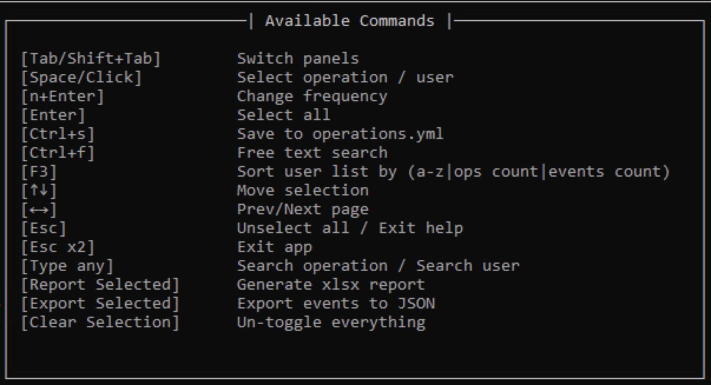

UAL Investigator
================

The Unified Audit Log Investigator is a Text UI application that provides an efficient search interface to quickly locate users and applications in an M365 tenant that performed certain operations. A pre-built list of indicators (see below) can identify potentially compromised accounts and service principals. The UAL Investigator reads the events ingested and pre-processed by the UAL Processor and can generate spreadsheet reports to highlight these indicators. This process is extremely fast as most of the heavy-lifting was already done by the UAL Processor during the log ingestion. 

.. image:: /images/app.png
   :alt: UAL Investigator
   :align: center

Statistics are collected by the UAL Processor such as how many successful and failed logins each day from each location occur, or the list of applications registered, inbox rules added, or even MFA devices registered, all broken down for every user or service principal in the tenant. A DFIR investigator for example can identify users that were compromised through Adversary in The Middle or all users that have been targeted by a password spraying attacks.

The tool would flag each day having met a certain criteria as "dodgy" and hence categorize that user or service pricipal as dodgy. For example, if there is at least one day when the user logged in successfully from at least 4 different countries, that could be considered as dodgy. Likewise, having logged in from more than three Internet Service Providers or ASN at any given day is also suspicious. Similarly, registering a new MFA device would be considered as dodgy too if it happens quite recently.

During client incident response engagements, this will be handy to quickly triage the whole tenant not only to idenify potentially compromised accounts, but also to pinpoint when the compromise may have started.

Current features supported are listed below:

1. Pre-built indicators of compromise including:

* Successful logins from multiple countries
* Successful logins from multiple ISPs
* Multiple failed MFA logins
* Potential bruteforce attack
* Potential AiTM/session hijacking attack
* Potential password spraying attack
* Suspicious search queries
* Suspicious file accessed/downloads

2. Efficient searching to locate users and apps or quickly match them by:

* pre-built indicators (configurable frequency parameters)
* operations (all operations identified from the logs are indexed configurable via the app or in yaml to enable them at startup)
* free text (currently indexed fields: subject, ip address, session id, client info string, asn, internet message id, user agent, application id)

3. Generate spreadsheet reports or export relevant events into json files
4. Text UI has been designed specifically for keyboard enthusiasts where all app controls are accessible without using the mouse pointer (although it works too!).

.. toctree::
   :maxdepth: 2
   :hidden:

   ual_parser/usage

